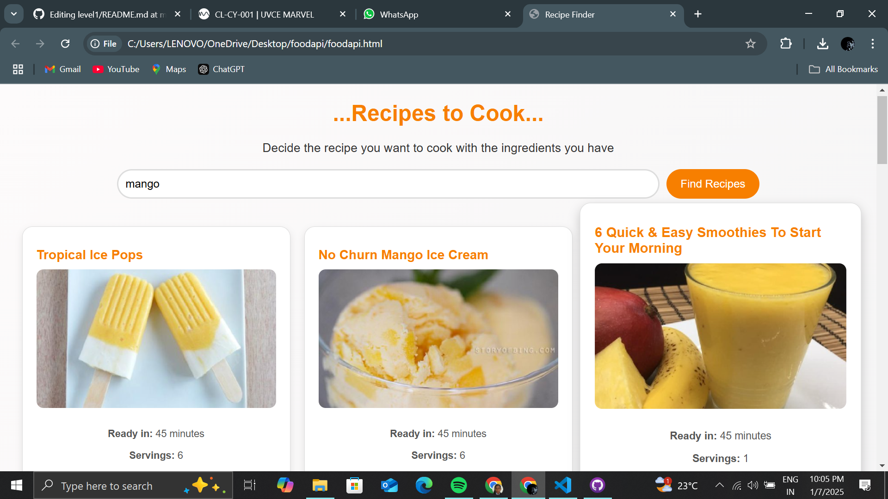
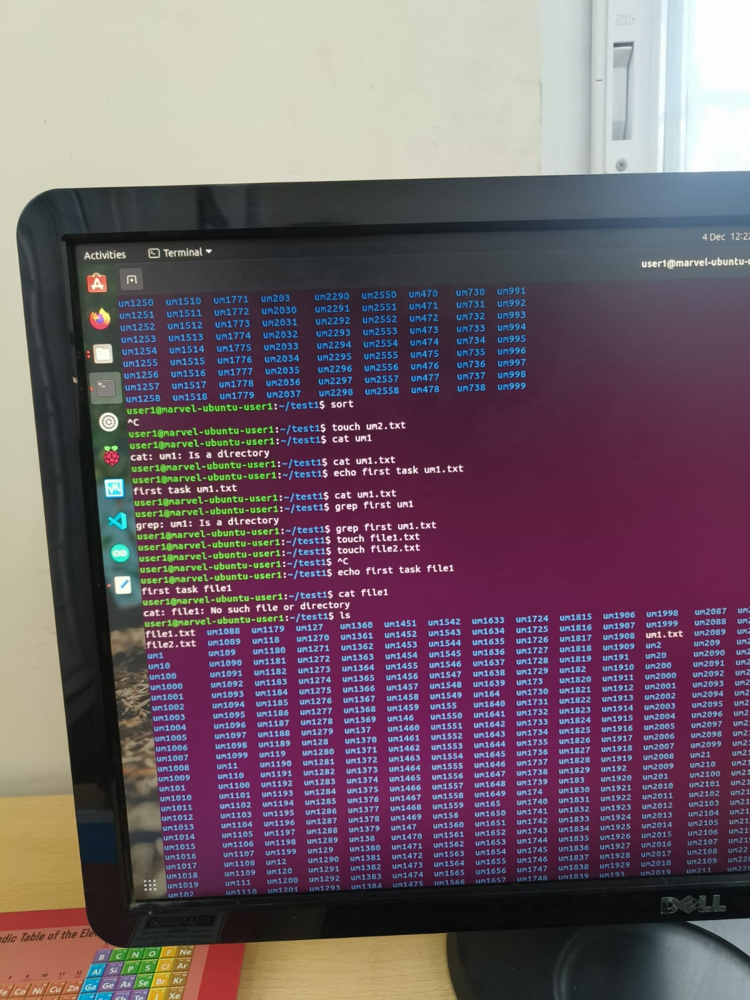
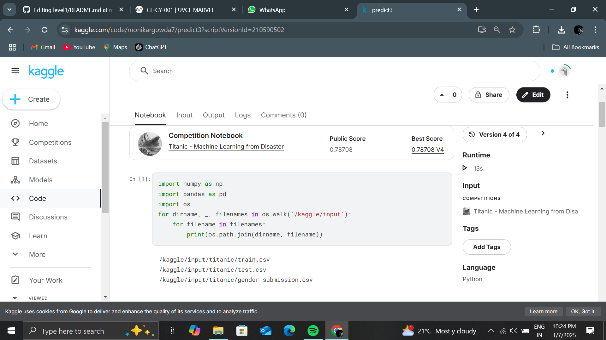
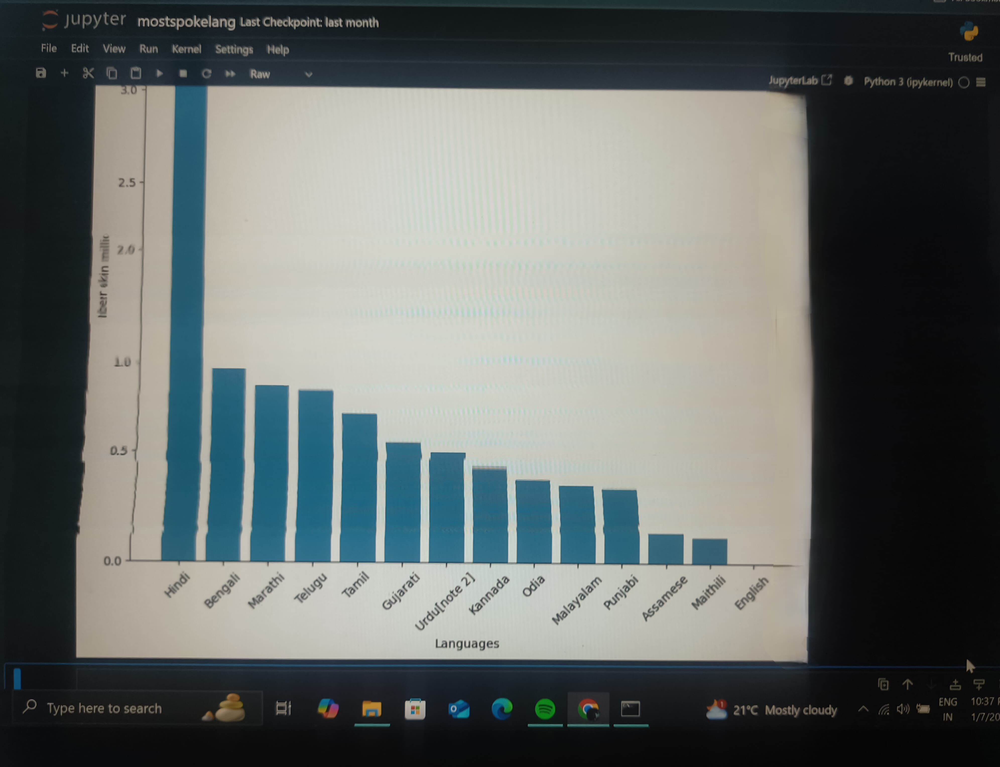

# Monika R-Level 1 Report 
## Task 1:API
Having interest in cooking something good and loving to eat things that taste great,I know how difficult it gets to think of what to cook with the available ingredients.
Using Spoonacular API,built an web page.Through this journey of building the page I learnt about API,how it works,what is it's use and importance
** LINK: **https://monikargowda.github.io/foodapi/ 

## TASK 2: Working with Github
This helped to understand and to explore the github features which would help in the long run.Solving problems in code, cloning and forking repositories and other basics were learnt.

## TASK 3: Get familiar with the command line on ubuntu and do the following subtasks:
To command the computer with different codes is something that I learnt.It was helpful in getting to know how powerful command prompts can be and how they could come handy.

## TASK 4: Kaggle contest
AIML is a powerful tool.Learnt how it is different from the normal codes that I was using.Used Random Forest to solve the roblem of finding who survived in the ship wreck.Depending on many factors like coach,gender,age,family together,etc. Gave an accuracy of 81.01%

## TASK 5: Working with Pandas and Matplotlib:
Plotting graphs manually were hassle.Having found a new way to plot them I created a bar graph that shows the most spoken language in India.It makes creating graphs easier by collecting the data required for the graph.

## TASK 6: Create a Portfolio Webpage
Presenting myself through a web page to show the skills I have learned and the projects I have done so far was a nice way to learn how to use and build the front end of any page.Using HTML and CSS 
** LINK: **

## TASK 7: Writing Resource Article using Markdown
To be able to edit and present the reports,articles and any write downs in a very presentable ad organised manner by a code is a easier way of writing.This helped in understanding markdown and it's features in a better way.
** LINK: **

## TASK 8: Tinkercad
To learn how different electronic components work and how they are used, we made a burglar alarm using  simple circuit using an ultrasonic sensor and servo motor to estimate the distance between an obstacle and the sensor.This helped to find many components and learn what they are used for.

## TASK 9: Speed Control of DC Motor
